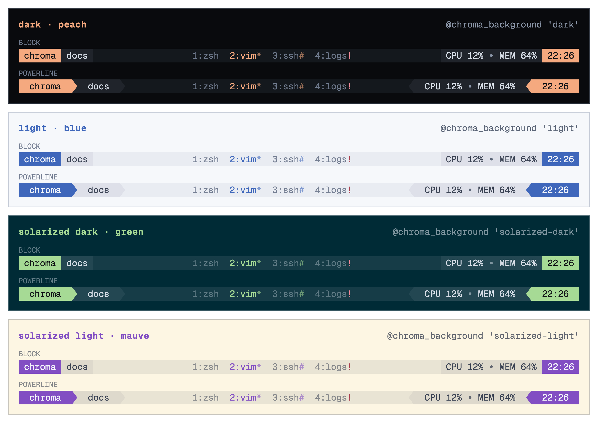

<div align="center">


**A minimal, host-aware status theme for tmux.**

[](https://github.com/jimeh/tmux-chroma/actions/workflows/ci.yml)
[](https://jimeh.github.io/tmux-chroma/)
[](https://github.com/jimeh/tmux-chroma/issues)
[](https://github.com/jimeh/tmux-chroma/pulls)
[](https://github.com/jimeh/tmux-chroma/blob/main/LICENSE)

</div>

Chroma deterministically assigns an accent preset from each machine's short
hostname, making hosts recognizable at a glance without per-machine
configuration.



Explore every preset and status mode on the
[interactive Chroma website](https://jimeh.github.io/tmux-chroma/).

## Features

- Stable, host-seeded accent colors with 22 included presets.
- Optional Powerline dividers.
- Prefix-key and synchronized-pane indicators.
- Bundled CPU and memory metrics for macOS and Linux.
- Optional free-disk metric for any path.
- Custom accent colors and extra left/right status content.
- Resolved palette options exported for other tmux configuration.

## Requirements

- tmux 3.2 or later.
- Bash 4.2 or later on Linux. The Bash included with macOS is supported.
- Standard platform tools: `cksum`, `awk`, `hostname`, `ps`, and
  `sysctl` or procfs.
- A font containing `` and `` when Powerline mode is enabled.

## Installation

### Tmux Plugin Manager

Add Chroma to `~/.tmux.conf` before TPM's initialization line:

```tmux
set -g @plugin 'jimeh/tmux-chroma'
```

Press `prefix + I` to install it, or reload tmux after TPM has already
installed the plugin.

### Manual

Clone the repository:

```sh
git clone https://github.com/jimeh/tmux-chroma.git \
  ~/.tmux/plugins/tmux-chroma
```

Run Chroma near the end of `~/.tmux.conf`, after setting any overrides:

```tmux
run-shell "${HOME}/.tmux/plugins/tmux-chroma/chroma.tmux"
```

## Options

Set options before Chroma loads:

| Option | Default | Description |
| --- | --- | --- |
| `@chroma_preset` | `auto` | Preset name below, or `auto` for host-seeded |
| `@chroma_base_color` | unset | Full `#rrggbb` accent override |
| `@chroma_background` | `dark` | Background: dark, light, a theme name, or #rrggbb |
| `@chroma_mode` | `auto` | Force the dark or light palette over the background |
| `@chroma_clock_format` | `%H:%M` | Clock `strftime` format |
| `@chroma_clock_min_width` | `91` | Minimum client width for the clock |
| `@chroma_powerline` | `off` | Powerline section dividers |
| `@chroma_status_interval` | `5` | Status refresh interval in seconds |
| `@chroma_show_cpu` | `on` | Show the CPU metric |
| `@chroma_show_memory` | `on` | Show the memory metric |
| `@chroma_show_disk` | `off` | Show available disk space |
| `@chroma_disk_path` | `/` | Path measured by the disk metric |
| `@chroma_host_label` | `#H` | Host segment text |
| `@chroma_left_extra` | unset | Extra left-side status text |
| `@chroma_right_extra` | unset | Extra right-side status text |

For example:

```tmux
set -g @chroma_preset 'peach'
set -g @chroma_powerline 'on'
set -g @chroma_show_disk 'on'
set -g @chroma_disk_path "${HOME}"

set -g @plugin 'jimeh/tmux-chroma'
run "${HOME}/.tmux/plugins/tpm/tpm"
```

The default `auto` hashes the machine's short hostname into a stable preset,
so every host keeps its own accent without per-machine configuration. An
invalid preset behaves like `auto`. An invalid custom base color is ignored.

## Presets

Chroma includes:

```text
blue        peach       teal        mauve       green       lavender
sapphire    pink        yellow      maroon      lime        ash
red         orchid      jade        plum        purple      rosewater
flamingo    sky         gold        cornflower
```

The selected preset supplies `base`. Chroma derives `base_alt` as a 60%
blend of `base` toward the bar background, including when
`@chroma_base_color` is used.

## Light mode

Set `@chroma_background` to `light` for a curated light palette. Every preset
has a light variant. A `#rrggbb` value classifies the background as light or
dark by perceived luma, then blends the status-bar surfaces toward that
terminal background. Popular themes are also available by name — each resolves
to that theme's background color and is treated like the matching `#rrggbb`:

`solarized-light`, `solarized-dark`, `tomorrow`, `tomorrow-night`,
`gruvbox-light`, `gruvbox-dark`, `one-light`, `one-dark`, `catppuccin-latte`,
`catppuccin-frappe`, `catppuccin-macchiato`, `catppuccin-mocha`,
`everforest-light`, `everforest-dark`, `rose-pine-dawn`, `rose-pine`,
`github-light`, `github-dark`, `dracula`, `nord`, `monokai`, `tokyo-night`

Set `@chroma_mode` to `dark` or `light` to override the luma classification
for backgrounds near the boundary; the background still supplies the color the
surfaces blend toward. The default `auto` follows `@chroma_background`.

`@chroma_base_color` is used verbatim in both modes, so choose a
light-appropriate custom accent yourself. Tmux cannot reliably query the
terminal's background, so `@chroma_background` is manual.

## Status behavior

- The clock is hidden on clients narrower than
  `@chroma_clock_min_width`.
- `SYNC` replaces the clock whenever the active pane is synchronized,
  regardless of client width.
- The prefix indicator always occupies the same space, keeping the centered
  window list still when the prefix key is pressed.
- Bell and activity tabs use muted text. Bell flags use the alert color;
  other window flags use `base_alt`.

## Exported options

Chroma publishes its resolved values as global tmux options:

```text
@chroma_base             @chroma_base_alt
@chroma_bg               @chroma_bg_alt
@chroma_fg               @chroma_muted
@chroma_subtle           @chroma_border
@chroma_warn             @chroma_alert
@chroma_ink              @chroma_dark
@chroma_current_mode     @chroma_current_preset
@chroma_preset_names     @chroma_plugin_dir
@chroma_sync_on          @chroma_sync_off
```

These can be reused by configuration loaded after Chroma.

## Development

Run the complete local validation:

```sh
make check
```

The tests load Chroma in an isolated tmux server, verify reload idempotency
and option behavior, exercise the bundled metric scripts, and ensure the
website palette stays in sync with the plugin.

## Credits

Chroma uses selected accent colors from the
[Catppuccin Macchiato palette](https://catppuccin.com/palette), under the MIT
license. Light accents are adapted from Catppuccin Latte. Chroma's neutral
colors, additional accents, layout, behavior, and implementation are its own.

See [THIRD_PARTY_NOTICES.md](THIRD_PARTY_NOTICES.md) for attribution.

## License

Chroma is available under the [MIT License](LICENSE).
